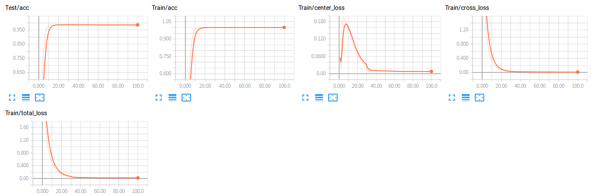

## Center loss by PyTorch
 This is an implementation of center loss [Wen et al. A Discriminative Feature Learning Approach for Deep Face Recognition. ECCV 2016.](https://ydwen.github.io/papers/WenECCV16.pdf )

### Requirements:
PyTorch(0.4 or later)  
Torchvision  
tensorboardX  
imageio(2.5.0)
matplotlib  
numpy

### train
```bash
$ cd center_loss
$ python3 main.py
```
After train, you can get about 98.6% accuracy. All feature picture is in logs/images. The gif(at logs dir) is below:
<div align="center">
  
    
</div>
left is feature distribution in train step, right is feature distribution in test step.  

### show results by tensorboard 
```bash
$ cd logs
$ tensorboard --logdir=tblog --port=6006
```
Then, go to http://0.0.0.0:6006. You can get that:
<div align="center">
  
</div>

### Reference
1. https://github.com/KaiyangZhou/pytorch-center-loss

